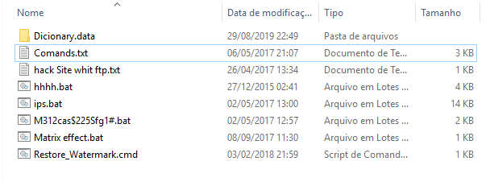

<h1 align="center">Hello, Welcome to My GitHub! 👋</h1>

<table>
<tr>
<td valign="top">

### About Me

- 🔒 Nearly a decade in cybersecurity and programming, forming my way of thinking and acting.
- 🛠 Well-versed in a gamut of technologies—ranging from programming languages to infosec tools.
- 🌐 Here, you'll find both professional projects and passion projects that I've decided not to keep to myself.
- 🌍 Fluent in English, Spanish and Portuguese, with ongoing studies in 10 additional languages. My multilingual capabilities facilitate cross-border collaborations and diversified problem-solving.

</td>
<td valign="top">

### Technologies and Tools

<!-- Interactive Badges -->

  
  
  

</td>
</tr>
</table>

## My Journey
At the age of eight, I got my very first computer during the golden era of Windows XP. I spent countless hours immersed in that world—playing CS 1.6 and exploring flash games that, more often than not, were designed simply to wreak havoc. I learned the hard way as viruses in those games repeatedly screwed up my PC. Instead of being discouraged, each reset only fueled my curiosity.

It was during these trials that I stumbled upon the mysterious CMD prompt—a stark black-on-white window that beckoned exploration. Despite barely knowing English or even my own language well enough, I began mimicking every command I found in assorted .bat files scattered across my system (after, of course, ensuring they weren't malicious). Slowly but surely, I pieced together the help pages and documentation, turning every experiment into a lesson.

By the time I turned 11, I had not only mastered these rudimentary commands but had also embraced hacking and programming as a passion—a challenge to be conquered rather than a risk to be feared. This journey, full of missteps and hard-won insights, laid the foundation for a lifelong adventure in the world of cybersecurity and technology, one I plan on keep going. My first (and last) ever recorded "lesson" learned from the YouTube itself is a "Matrix" batch script, in late 2015.

  

Which makes me a proud 10+ years programmer and +/- 10 years digital security breacher guy. 
And yes I barely knew proper grammar then. This changed. (I guess).

<h2>What Captures My Attention</h2>
<ul>
  <li>🔐 Cybersecurity Challenges and Solutions: As a seasoned cybersecurity consultant, my curiosity is piqued by the rapidly evolving landscape of cyber threats and mitigations. The ethical dimensions and intricate technicalities in this domain continually draw my focus.</li>
  <li>🌐 Emerging Technologies and Programming Paradigms: An early adopter at heart, I am fascinated by technological innovations and shifts in programming paradigms. My interest ranges from quantum computing to blockchain, and from functional to reactive programming, embodying my continual strive for professional growth.</li>
  <li>💰 Entrepreneurship and innovative investment strategies also capture my attention, embodying my business acumen.</li>
</ul>

<h2>Currently Focused On</h2>
<ul>
  <li>📂 Consciously curating a portfolio that reflects not just my technical prowess but also my diverse expertise. My aim is to build a cohesive digital archive that serves as a testament to my skills, ethical approach, and societal contributions.</li>
  <li>🎯 The intersection of passion and proficiency is where my personal projects lie. These endeavors, often initiated as exploratory exercises or hobbyist experiments, are undergoing a transformation into polished, professional solutions, freely available for the tech community.</li>
</ul>

<h2>Open for Collaboration On</h2>
<ul>
  <li>🌱 I welcome collaborative initiatives that aim to uplift the community, be it through open-source contributions, educational platforms, or social empowerment.</li>
  <li>💡 As someone with substantial experience in cybersecurity, I'm continually on the lookout for groundbreaking approaches to tackle both longstanding and emerging threats. I am particularly interested in collaborating on projects that push the boundaries of traditional cybersecurity norms.</li>
  <li>🌐 Open to partnering on endeavors that combine multiple aspects of technology, such as integrating AI in cybersecurity, IoT applications in agribusiness, or blockchain in secure data transactions.</li>
  <li>🎵 With fluency in multiple languages and a passion for artistic expression, I am also open to collaborations that involve cultural interchange, translation services, or combining technology and the arts.</li>
</ul>

## Certifications & Achievements
- [Unavailable] (Coming soon, don't know if gotta have this amount of commitment to this repo to share this)

<h3>Featured Projects</h3>
<ul>
  <li>💼 <a href="https://github.com/Protoncracker/Winux/">Winux</a> - A cross-platform terminal tool made with terminal and Python. Brings together features from CMD, Linux Shell, and PowerShell for a versatile and easy terminal experience.</li>
  <li>⭐ <a href="https://github.com/Protoncracker/exifpy">Exifpy</a> - An EXIF tool built with Python. Offers dual-interface and serves both as a standalone application and an importable package for code integration.</li>
  <li>*More to be added on...* I currently own approximately 200 projects, each abundant in code that I plan to comment on and structure more efficiently for this platform. As I'm in the early stages of using GitHub, you may want to stay tuned for further developments, it wont take long :)</li>
</ul>

## Personal Quotes
> Sacrifice: "The Bird of Hermes is my name, eating my wings to make me tame."

> Passion: "A hacker needs only an entrypoint—if it exists, every wall is just a challenge waiting to be bypassed."

## Stats

  

<!-- Dynamic Contributions Widget -->

  

<h2>Get in Touch (professional)</h2>

📧 <a href="mailto:tryme.freefall963@passinbox.com">Email</a>

## Contributing
Contributions, issues, and feature requests are always welcome!  
Every contribution — even the smallest character change — is highly appreciated and noted.  
Whether you're improving a project or collaborating with me, your support makes a real difference.  
Each project I own has its own unique way of rewarding contributions, and I'm sincerely grateful for every effort.

## Connect
Feel free to reach out on any of my social medias.

## Find Me Elsewhere
- Twitter: [@protoncracker](https://twitter.com/protoncracker)
- YouTube: [protoncracker_xp](https://www.youtube.com/@protoncracker_xp)
- TikTok: [@protoncracker_xp](https://www.tiktok.com/@protoncracker_xp)
- Instagram: [@protoncracker](https://www.instagram.com/protoncracker/)
- StackOverflow: [Protoncracker](https://stackoverflow.com/users/22671125/protoncracker)
- GitHub: [Protoncracker](https://github.com/Protoncracker)
- Reddit:  
  - r/ErgoMonitor: [ErgoMonitor](https://www.reddit.com/r/ErgoMonitor/)
  - r/Thrintur: [Thrintur](https://www.reddit.com/r/Thrintur/)
  - r/Winux: [Winux](https://www.reddit.com/r/Winux/)
  - Profile: [u/protoncracker](https://www.reddit.com/user/protoncracker)
- Pinterest: [protoncracker_xp](https://br.pinterest.com/protoncracker_xp/)
- Quora:  
  - [ergomonitor](https://ergomonitor.quora.com/)
  - [winux](https://winux.quora.com/)
  - [thrintur](https://thrintur.quora.com/)
  - [Protoncracker](https://pt.quora.com/profile/Protoncracker)
- Medium: [@protoncracker](https://medium.com/@protoncracker)
- Patreon: [Protoncracker](https://patreon.com/Protoncracker)
- Ko-fi: [Protoncracker](https://ko-fi.com/protoncracker)
- Buy Me a Coffee: [Protoncracker](https://www.buymeacoffee.com/protoncracker)

## Special Thanks

I want to extend my heartfelt gratitude to everyone who has accompanied me on this journey. Your support during tough times and your willingness to help, no matter how small, means the world to me. Thank you for being there and for your unwavering encouragement.
